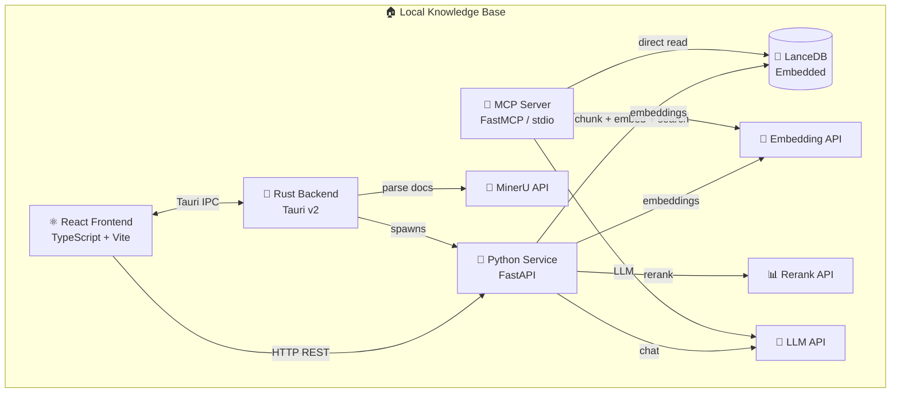

# Local Agent Knowledge Base

A local-first desktop knowledge base application designed for AI agent integration. Built with **Tauri v2 + React + Python**, supports **OpenAI-compatible embedding & rerank models**, **MinerU document parsing**, and ships with an **MCP server** for Claude Code and other AI agents.

[](LICENSE)
[](https://tauri.app/)
[](https://python.org)
[](https://modelcontextprotocol.io/)
[](README.md) [](README.zh-CN.md)

## Features

### 📄 Document Management
- **Multi-format support**: PDF, DOCX, PPTX, XLSX, images (PNG/JPG/WebP), HTML
- **Drag & drop upload** with file type validation
- **MinerU integration** for high-quality document parsing:
  - 🎯 **Precise mode** (v4 extract/task): Token auth, ≤200MB, ≤200 pages, tables/formulas
  - ⚡ **Agent mode** (v1 agent/parse): No auth, ≤10MB, ≤20 pages, for AI workflows
- **Markdown preview** of parsed documents
- **Parse status tracking** with progress indicators

### 🔍 Knowledge Management
- **Multiple knowledge bases** with independent indexes
- **Intelligent chunking** strategies:
  - **Recursive** (recommended) — paragraph → sentence → fixed-size
  - **Semantic** — sentence boundary aware
  - **Fixed-size** — configurable with overlap
- **Hybrid search**: Dense vector + BM25 keyword (FTS)
- **Reranking** for search result refinement
- **RAG Chat**: Conversational Q&A with streaming responses and source citations

### 🤖 AI Model Integration (OpenAI-compatible)
- **Embedding**: OpenAI, Azure, Ollama, vLLM, LiteLLM, LM Studio, or any `/v1/embeddings` endpoint
- **Rerank**: Jina AI, Cohere, or any `/v1/rerank` or `/rerank` endpoint
- **LLM**: OpenAI, Azure, Ollama, vLLM, or any `/v1/chat/completions` endpoint
- **100% provider-agnostic** — you control the models

### 🔌 MCP Server (Model Context Protocol)
- **4 tools** for AI agents:
  - `search_knowledge_base` — Hybrid search with reranking
  - `list_knowledge_bases` — List all KBs with stats
  - `get_document` — Full document retrieval
  - `ask_question` — RAG-powered Q&A
- **stdio transport** — runs as a subprocess
- **`uvx` compatible** — one-command launch
- **No dependency** on the desktop app — reads LanceDB directly
- Designed for **Claude Code**, but works with any MCP client

### 🎨 Desktop UI
- **Clean, modern interface** with dark/light mode support
- **Sidebar navigation** with KB list
- **Dashboard** with KB statistics
- **Document manager** with upload, parse, index, and preview
- **Search interface** with toggleable hybrid/vector/keyword modes
- **RAG Chat** with streaming and source citations
- **Settings panel** for all API keys and model configurations

---

## Architecture



### Technology Stack

| Layer | Technology |
|-------|-----------|
| Desktop Shell | [Tauri v2](https://tauri.app/) (Rust) |
| Frontend | React 18 + TypeScript + Vite + Tailwind CSS |
| State | Zustand + TanStack React Query |
| Backend | FastAPI + uvicorn (Python) |
| Vector DB | [LanceDB](https://lancedb.com/) (embedded) |
| MCP Server | [FastMCP](https://github.com/jlowin/fastmcp) (Python) |
| Toolchain | npm, uv, cargo |

---

## Quick Start

### Prerequisites

- **Node.js** ≥ 18
- **npm** ≥ 8
- **Rust** ≥ 1.75 (with `cargo`)
- **Python** ≥ 3.11
- **uv** (Python package manager) — [install guide](https://docs.astral.sh/uv/getting-started/installation/)

### Installation

```bash
# Clone the repository
git clone https://github.com/your-username/local-knowledge-base.git
cd local-knowledge-base

# Install frontend dependencies
npm install

# Install Python backend dependencies
cd services/python-backend
uv sync
cd ../..

# Install MCP server dependencies
cd apps/mcp-server
uv sync
cd ../..

# Build and run the desktop app
npm tauri dev
```

### First Launch

1. The app starts and auto-launches the Python backend
2. Go to **Settings** and configure your API keys:
   - **Embedding API**: OpenAI, Ollama, or any compatible provider
   - **Rerank API** (optional): Jina AI or Cohere
   - **LLM API**: For RAG chat functionality
   - **MinerU Token** (optional): For high-quality parsing of large documents
3. Create a **Knowledge Base**
4. **Upload documents** — the app auto-parses using MinerU (agent mode if no token, precise mode with token)
5. Click **Index** on parsed documents to generate embeddings and store in LanceDB
6. **Search** or **Chat** with your knowledge base!

---

## Configuration

### Settings Reference

All settings are managed through the desktop app UI. They are persisted to `settings.json` in the app data directory.

| Setting | Description | Default |
|---------|-------------|---------|
| `mineru_token` | MinerU API token for precise parsing | (empty) |
| `embedding_api_base` | Embedding API base URL | `https://api.openai.com` |
| `embedding_api_key` | Embedding API key | (empty) |
| `embedding_model` | Embedding model name | `text-embedding-3-small` |
| `rerank_api_base` | Rerank API base URL | `https://api.jina.ai` |
| `rerank_api_key` | Rerank API key | (empty) |
| `rerank_model` | Rerank model name | `jina-reranker-v2-base-multilingual` |
| `llm_api_base` | Chat LLM API base URL | `https://api.openai.com` |
| `llm_api_key` | Chat LLM API key | (empty) |
| `llm_model` | Chat LLM model name | `gpt-4o-mini` |
| `chunk_strategy` | Chunking method | `recursive` |
| `chunk_size` | Characters per chunk | `512` |
| `chunk_overlap` | Overlap between chunks | `50` |

### OpenAI-compatible Providers

The app works with any OpenAI-compatible API. Here are common configurations:

**OpenAI**
```
Embedding: https://api.openai.com  |  text-embedding-3-small
LLM:       https://api.openai.com  |  gpt-4o-mini
```

**Ollama (local)**
```
Embedding: http://localhost:11434  |  nomic-embed-text
LLM:       http://localhost:11434  |  llama3.2
```

**vLLM / LiteLLM (self-hosted)**
```
Embedding: http://localhost:8000   |  your-model
LLM:       http://localhost:8000   |  your-model
```

**Jina AI (rerank)**
```
Rerank:    https://api.jina.ai     |  jina-reranker-v2-base-multilingual
```

**Cohere (rerank)**
```
Rerank:    https://api.cohere.com  |  rerank-english-v3.0
```

### MinerU API Setup

1. Go to [MinerU API Management](https://mineru.net/apiManage/docs)
2. Create a token in the API management page
3. Paste the token in the app Settings under "MinerU Token"

**Without a token**: The app falls back to MinerU's Agent-mode API (no auth, rate-limited, ≤10MB files). This is sufficient for most personal use cases.

**With a token**: Full precise parsing with table/formula recognition, support for files up to 200MB and 200 pages.

---

## MCP Server Usage

The MCP server enables AI agents (especially **Claude Code**) to search and query your knowledge bases.

### Configuration for Claude Code

Add to your `claude_desktop_config.json` or `.claude/settings.json`:

```json
{
  "mcpServers": {
    "local-knowledge-base": {
      "command": "uv",
      "args": [
        "run",
        "--directory",
        "/path/to/local-knowledge-base/apps/mcp-server",
        "local-kb-mcp"
      ],
      "env": {
        "KNOWLEDGE_BASE_DATA_DIR": "$HOME/.local-knowledge-base",
        "EMBEDDING_API_BASE": "https://api.openai.com",
        "EMBEDDING_API_KEY": "sk-your-key-here",
        "EMBEDDING_MODEL": "text-embedding-3-small",
        "RERANK_API_BASE": "https://api.jina.ai",
        "RERANK_API_KEY": "jina-your-key-here",
        "RERANK_MODEL": "jina-reranker-v2-base-multilingual",
        "LLM_API_BASE": "https://api.openai.com",
        "LLM_API_KEY": "sk-your-key-here",
        "LLM_MODEL": "gpt-4o-mini"
      }
    }
  }
}
```

> 💡 Replace `$HOME/.local-knowledge-base` with your actual data directory path.

### Using `uvx` from a Git Repository

Once the project is published to GitHub:

```json
{
  "mcpServers": {
    "local-knowledge-base": {
      "command": "uvx",
      "args": [
        "--from",
        "git+https://github.com/your-username/local-knowledge-base#subdirectory=apps/mcp-server",
        "local-kb-mcp"
      ],
      "env": {
        "KNOWLEDGE_BASE_DATA_DIR": "/path/to/app/data",
        "EMBEDDING_API_BASE": "https://api.openai.com",
        "EMBEDDING_API_KEY": "sk-...",
        "EMBEDDING_MODEL": "text-embedding-3-small"
      }
    }
  }
}
```

### Available MCP Tools

#### `search_knowledge_base`

Search a knowledge base with hybrid search and optional reranking.

```json
{
  "query": "What is the architecture of the system?",
  "kb_id": "your-kb-uuid",
  "top_k": 10,
  "search_type": "hybrid",
  "rerank": true
}
```

Returns chunks with scores and source document references.

#### `list_knowledge_bases`

List all available knowledge bases:

```
No parameters required.
```

Returns KB IDs, table names, document counts, and chunk counts.

#### `get_document`

Retrieve a document's full text content:

```json
{
  "kb_id": "your-kb-uuid",
  "doc_id": "document-uuid",
  "include_chunks": false
}
```

Returns the complete document text reconstructed from chunks.

#### `ask_question`

Ask a question and get an LLM-generated answer with citations:

```json
{
  "kb_id": "your-kb-uuid",
  "question": "Summarize the key findings",
  "top_k": 5,
  "include_sources": true
}
```

Requires `LLM_API_KEY` to be configured.

### Running the MCP Server Manually

```bash
# Development
cd apps/mcp-server
uv run local-kb-mcp

# Production (from installed package)
local-kb-mcp

# From Git (one-shot)
uvx --from git+https://github.com/user/local-knowledge-base#subdirectory=apps/mcp-server local-kb-mcp
```

---

## Development

### Project Structure

```
local-knowledge-base/
├── apps/
│   ├── desktop/                    # Tauri v2 + React app
│   │   ├── src-tauri/              # Rust backend
│   │   │   └── src/
│   │   │       ├── commands/       # IPC: documents, kb, parsing, settings, python_service
│   │   │       ├── mineru/         # MinerU API client (precise + agent)
│   │   │       ├── storage/        # Local file management
│   │   │       └── models/         # Shared Rust data models
│   │   └── src/                    # React frontend
│   │       ├── components/         # UI components
│   │       ├── stores/             # Zustand state stores
│   │       ├── services/           # tauriBridge + pythonClient
│   │       └── types/              # TypeScript type definitions
│   └── mcp-server/                 # Python MCP server (FastMCP)
│       └── src/knowledge_mcp/
│           ├── server.py           # MCP tool definitions
│           └── lancedb_client.py   # LanceDB access layer
├── services/
│   └── python-backend/             # Python FastAPI service
│       └── src/knowledge_backend/
│           ├── api/                # REST endpoints
│           ├── db/                 # LanceDB manager + schemas
│           ├── embedding.py        # OpenAI-compatible embedding
│           ├── reranker.py         # OpenAI-compatible rerank
│           └── chunker.py          # Text chunking strategies
└── packages/
    └── shared-types/               # Shared TypeScript definitions
```

### Running Components Individually

```bash
# Frontend dev server only
cd apps/desktop
npm dev

# Desktop app (full Tauri)
npm tauri dev

# Python backend only
cd services/python-backend
uv run knowledge-backend

# MCP server only
cd apps/mcp-server
uv run local-kb-mcp
```

### Running Tests

```bash
# Rust tests
cd apps/desktop/src-tauri
cargo test

# Python tests
cd services/python-backend
uv run pytest

# MCP server tests
cd apps/mcp-server
uv run pytest
```

### Building for Release

```bash
# Build the Tauri desktop app
npm tauri build

# Package the MCP server for distribution
cd apps/mcp-server
uv build
```

---

## Data Storage

All data is stored locally under `~/.local-knowledge-base/` by default.

| Platform | Default Path |
|----------|------|
| Windows | `%USERPROFILE%\.local-knowledge-base\` |
| macOS | `~/.local-knowledge-base/` |
| Linux | `~/.local-knowledge-base/` |

Directory structure:
```
~/.local-knowledge-base/
├── settings.json              # App configuration
├── knowledge_bases.json       # KB metadata registry
├── kb_{uuid-1}/               # Knowledge base 1
│   ├── docs/                  # Original + parsed documents
│   │   └── {doc-id}/
│   │       ├── original.pdf   # Original file
│   │       ├── full.md        # MinerU parsed markdown
│   │       └── metadata.json  # Document metadata
│   └── index_state.json
├── kb_{uuid-2}/               # Knowledge base 2
└── lancedb_data/              # Vector indexes (shared with MCP server)
    └── *.lance                # LanceDB table files
```

---

## FAQ

### Can I use local models (Ollama)?

Yes! Point any of the API endpoints to your local Ollama server:

- Embedding: `http://localhost:11434` with model like `nomic-embed-text`
- LLM: `http://localhost:11434` with model like `llama3.2`

### Do I need a MinerU token?

No. The app works without a token using MinerU's free Agent-mode API (≤10MB files, ≤20 pages, IP rate-limited). For larger files or higher quality parsing (tables/formulas), get a free token from [MinerU](https://mineru.net/apiManage/docs).

### Can the MCP server run without the desktop app?

Yes! The MCP server accesses LanceDB directly — it does not require the desktop app or Python backend to be running. Just configure `KNOWLEDGE_BASE_DATA_DIR` to point to `~/.local-knowledge-base`.

### What embedding dimension should I use?

The app auto-detects the dimension from the first embedding call. Common models:
- OpenAI `text-embedding-3-small`: 1536
- OpenAI `text-embedding-3-large`: 3072
- Ollama `nomic-embed-text`: 768

### How do I backup my knowledge bases?

Copy the `lancedb_data/` directory from the app data folder. To restore, place it back in the same location. The `docs/` directories contain original and parsed files.

---

## License

MIT © 2026 Local Knowledge Base Contributors

---

## Acknowledgments

- [MinerU](https://mineru.net/) — Document parsing API
- [Tauri](https://tauri.app/) — Desktop app framework
- [LanceDB](https://lancedb.com/) — Embedded vector database
- [FastMCP](https://github.com/jlowin/fastmcp) — MCP server framework
- [FastAPI](https://fastapi.tiangolo.com/) — Python web framework
