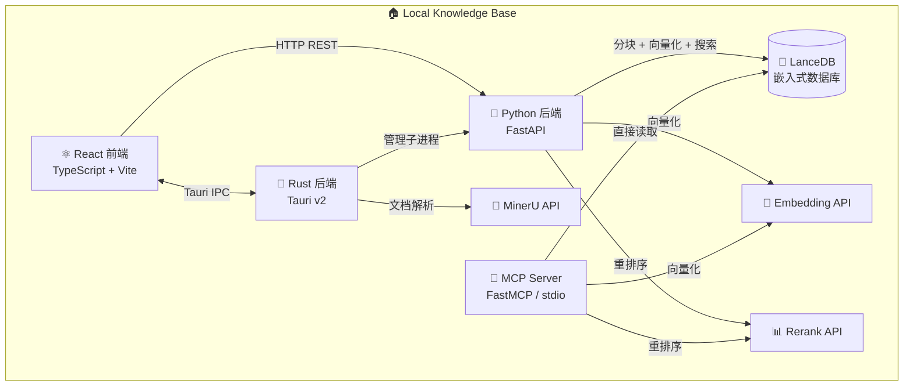

# Local Agent Knowledge Base

一款本地优先的桌面知识库应用，专为 AI Agent 集成设计。基于 **Tauri v2 + React + Python**，支持 **OpenAI 兼容格式的 Embedding 与 Rerank 模型**、**MinerU 文档解析**，并内置 **MCP Server** 供 Claude Code 等 AI Agent 调用。

[](LICENSE)
[](https://tauri.app/)
[](https://python.org)
[](https://modelcontextprotocol.io/)
[](README.md) [](README.zh-CN.md)

## 功能特性

### 📄 文档管理
- **多格式支持**：PDF、DOCX、PPTX、XLSX、图片（PNG/JPG/WebP）、HTML
- **拖拽上传**，自动校验文件类型
- **MinerU 集成**，高质量文档解析：
  - 🎯 **精准模式**（v4 extract/task）：需要 Token，≤200MB，≤200 页，支持表格/公式识别
  - ⚡ **Agent 模式**（v1 agent/parse）：无需认证，≤10MB，≤20 页，专为 AI Agent 工作流设计
- **Markdown 预览**已解析文档
- **解析状态追踪**，实时进度反馈

### 🔍 知识管理
- **多个知识库**，独立索引互不干扰
- **智能分块策略**：
  - **递归分块**（推荐）— 段落 → 句子 → 定长，逐级切分
  - **语义分块** — 按句子边界分割
  - **定长分块** — 可配置块大小与重叠
- **混合搜索**：稠密向量 + BM25 关键词（全文搜索）
- **Rerank 重排序**优化搜索精度

### 🤖 AI 模型集成（OpenAI 兼容）
- **Embedding**：OpenAI、Azure、Ollama、vLLM、LiteLLM、LM Studio 等任意 `/v1/embeddings` 端点
- **Rerank**：Jina AI、Cohere 等任意 `/v1/rerank` 或 `/rerank` 端点
- **100% 厂商无关** — 你完全掌控所使用的模型

### 🔌 MCP Server（模型上下文协议）
- **3 个工具**供 AI Agent 调用：
  - `search_knowledge_base` — 混合搜索 + 重排序
  - `list_knowledge_bases` — 列出所有知识库及统计信息
  - `get_document` — 获取完整文档内容
- **stdio 传输** — 作为子进程运行
- **`uvx` 兼容** — 一行命令启动
- **无需桌面应用** — 直接读取 LanceDB，可独立运行
- 专为 **Claude Code** 设计，同时兼容任意 MCP 客户端
- LLM 问答由 Agent 自身（如 Claude Code）利用搜索结果完成

### 🎨 桌面界面
- **自定义无边框窗口**，标题栏与内容融为一体
- **深色/浅色模式**和**中/英文切换**
- **侧边栏导航**，知识库一目了然
- **仪表盘**展示知识库统计
- **文档管理**：上传、解析、索引、预览
- **搜索界面**：混合/向量/关键词模式一键切换
- **设置面板**：统一管理所有 API Key 和模型配置

---

## 架构



### 技术栈

| 层级 | 技术 |
|-------|-----------|
| 桌面框架 | [Tauri v2](https://tauri.app/) (Rust) |
| 前端 | React 18 + TypeScript + Vite + Tailwind CSS |
| 状态管理 | Zustand + TanStack React Query |
| 后端服务 | FastAPI + uvicorn (Python) |
| 向量数据库 | [LanceDB](https://lancedb.com/) (嵌入式) |
| MCP 服务 | [FastMCP](https://github.com/jlowin/fastmcp) (Python) |
| 工具链 | npm, uv, cargo |

---

## 快速开始

### 环境要求

- **Node.js** ≥ 18
- **npm** ≥ 8
- **Rust** ≥ 1.75（含 `cargo`）
- **Python** ≥ 3.11
- **uv**（Python 包管理器）— [安装指南](https://docs.astral.sh/uv/getting-started/installation/)

### 安装步骤

```bash
# 克隆仓库
git clone https://github.com/your-username/local-knowledge-base.git
cd local-knowledge-base

# 安装前端依赖（从工作区根目录）
npm install

# 安装 Python 后端依赖
cd services/python-backend && uv sync && cd ../..

# 安装 MCP Server 依赖
cd apps/mcp-server && uv sync && cd ../..

# 启动桌面应用
cd apps/desktop
npm run tauri dev
```

### 首次使用

1. 启动应用后，Python 后端会自动运行
2. 前往 **Settings** 配置 API Key：
   - **Embedding API**：OpenAI、Ollama 或任意兼容服务
   - **Rerank API**（可选）：Jina AI 或 Cohere
   - **MinerU Token**（可选）：高质量大文件解析
3. 创建一个**知识库**
4. **上传文档** — 应用自动调用 MinerU 解析（无 Token 用 Agent 模式，有 Token 用精准模式）
5. 解析完成后点击 **Index** 生成向量并存入 LanceDB
6. **搜索**你的知识库，或通过 MCP Server 连接 Claude Code 进行 AI 问答

---

## 配置说明

### 设置项参考

所有设置通过桌面应用 UI 管理，持久化保存在 `~/.local-knowledge-base/settings.json`。

| 设置项 | 说明 | 默认值 |
|---------|-------------|---------|
| `mineru_token` | MinerU 精准解析 API Token | (空) |
| `embedding_api_base` | Embedding API 地址 | `https://api.openai.com` |
| `embedding_api_key` | Embedding API 密钥 | (空) |
| `embedding_model` | Embedding 模型名称 | `text-embedding-3-small` |
| `rerank_api_base` | Rerank API 地址 | `https://api.jina.ai` |
| `rerank_api_key` | Rerank API 密钥 | (空) |
| `rerank_model` | Rerank 模型名称 | `jina-reranker-v2-base-multilingual` |
| `chunk_strategy` | 分块策略 | `recursive` |
| `chunk_size` | 每块字符数 | `512` |
| `chunk_overlap` | 块之间重叠字符数 | `50` |

### OpenAI 兼容服务配置

以下为常见服务的配置示例：

**OpenAI**
```
Embedding: https://api.openai.com  |  text-embedding-3-small
```

**Ollama（本地）**
```
Embedding: http://localhost:11434  |  nomic-embed-text
```

**vLLM / LiteLLM（自建）**
```
Embedding: http://localhost:8000   |  your-model
```

**Jina AI（Rerank）**
```
Rerank:    https://api.jina.ai     |  jina-reranker-v2-base-multilingual
```

**Cohere（Rerank）**
```
Rerank:    https://api.cohere.com  |  rerank-english-v3.0
```

### MinerU API 配置

1. 前往 [MinerU API 管理页面](https://mineru.net/apiManage/docs)
2. 在 API 管理页面创建 Token
3. 将 Token 粘贴到应用 Settings 中的 "MinerU Token"

**无 Token 时**：应用自动使用 MinerU 的 Agent 模式（无需认证，有 IP 频限，≤10MB）。对大多数个人使用场景已足够。

**有 Token 时**：完整精准解析，支持表格/公式识别，文件上限 200MB、200 页。

---

## MCP Server 使用指南

MCP Server 让 AI Agent（特别是 **Claude Code**）能够搜索和查询你的知识库。Claude Code 负责 LLM 推理——MCP Server 提供知识检索。

### Claude Code 配置

在 `claude_desktop_config.json` 或 `.claude/settings.json` 中添加：

```json
{
  "mcpServers": {
    "local-knowledge-base": {
      "command": "uv",
      "args": [
        "run",
        "--directory",
        "/path/to/local-knowledge-base/apps/mcp-server",
        "local-kb-mcp"
      ],
      "env": {
        "KNOWLEDGE_BASE_DATA_DIR": "$HOME/.local-knowledge-base",
        "EMBEDDING_API_BASE": "https://api.openai.com",
        "EMBEDDING_API_KEY": "sk-your-key-here",
        "EMBEDDING_MODEL": "text-embedding-3-small",
        "RERANK_API_BASE": "https://api.jina.ai",
        "RERANK_API_KEY": "jina-your-key-here",
        "RERANK_MODEL": "jina-reranker-v2-base-multilingual"
      }
    }
  }
}
```

> 💡 将 `$HOME/.local-knowledge-base` 替换为实际的数据目录路径。Windows 下请使用 `C:\Users\<你的用户名>\.local-knowledge-base`。

### 通过 uvx 从 Git 仓库启动

项目发布到 GitHub 后，可直接使用 `uvx` 一行启动：

```json
{
  "mcpServers": {
    "local-knowledge-base": {
      "command": "uvx",
      "args": [
        "--from",
        "git+https://github.com/your-username/local-knowledge-base#subdirectory=apps/mcp-server",
        "local-kb-mcp"
      ],
      "env": {
        "KNOWLEDGE_BASE_DATA_DIR": "$HOME/.local-knowledge-base",
        "EMBEDDING_API_BASE": "https://api.openai.com",
        "EMBEDDING_API_KEY": "sk-...",
        "EMBEDDING_MODEL": "text-embedding-3-small"
      }
    }
  }
}
```

### MCP 工具说明

#### `search_knowledge_base`

搜索知识库，支持混合搜索和重排序。

```json
{
  "query": "系统的架构是什么？",
  "kb_id": "你的知识库UUID",
  "top_k": 10,
  "search_type": "hybrid",
  "rerank": true
}
```

返回带相关性分数和来源文档的文本块列表。

#### `list_knowledge_bases`

列出所有可用的知识库——无需参数，返回 ID、文档数、分块数等统计。

#### `get_document`

获取文档的完整文本内容：

```json
{
  "kb_id": "你的知识库UUID",
  "doc_id": "文档UUID",
  "include_chunks": false
}
```

将从分块中重建完整文档内容。

### Claude Code 如何使用这些工具

当你向 Claude Code 提问关于文档的问题时，它可以：
1. 调用 `search_knowledge_base` 找到相关文本块
2. 用自己的推理能力综合搜索结果生成回答
3. 必要时调用 `get_document` 阅读完整原文

这比内置的 RAG 对话更强大，因为 Claude Code 可以进行多步推理、跨知识库交叉引用，并将文档知识与通用能力结合。

### 手动运行 MCP Server

```bash
# 开发环境
cd apps/mcp-server
uv run local-kb-mcp

# 从已安装的包运行
local-kb-mcp

# 从 Git 仓库一键运行
uvx --from git+https://github.com/your-username/local-knowledge-base#subdirectory=apps/mcp-server local-kb-mcp
```

---

## 开发指南

### 项目结构

```
local-knowledge-base/
├── apps/
│   ├── desktop/                    # Tauri v2 + React 桌面应用
│   │   ├── src-tauri/              # Rust 后端
│   │   │   └── src/
│   │   │       ├── commands/       # IPC: 文档、知识库、解析、设置、Python 服务
│   │   │       ├── mineru/         # MinerU API 客户端（精准 + Agent 模式）
│   │   │       ├── storage/        # 本地文件管理
│   │   │       └── models/         # Rust 数据模型
│   │   └── src/                    # React 前端
│   │       ├── components/         # 界面组件
│   │       ├── stores/             # Zustand 状态
│   │       ├── services/           # tauriBridge + pythonClient
│   │       ├── i18n/               # 国际化
│   │       └── types/              # TypeScript 类型
│   └── mcp-server/                 # Python MCP Server (FastMCP)
│       └── src/knowledge_mcp/
│           ├── server.py           # MCP 工具定义
│           └── lancedb_client.py   # LanceDB 访问层
├── services/
│   └── python-backend/             # Python FastAPI 服务
│       └── src/knowledge_backend/
│           ├── api/                # REST 端点（搜索、索引、知识库 CRUD）
│           ├── db/                 # LanceDB 管理 + Schema
│           ├── embedding.py        # OpenAI 兼容 Embedding
│           ├── reranker.py         # OpenAI 兼容 Rerank
│           └── chunker.py          # 文本分块策略
└── packages/
    └── shared-types/               # 共享 TypeScript 类型
```

### 独立运行各组件

```bash
# 仅前端开发服务器
cd apps/desktop
npm run dev

# 完整桌面应用
cd apps/desktop && npm run tauri dev

# 仅 Python 后端
cd services/python-backend
uv run knowledge-backend

# 仅 MCP Server
cd apps/mcp-server
uv run local-kb-mcp
```

### 运行测试

```bash
# Rust 测试
cd apps/desktop/src-tauri
cargo test

# Python 测试
cd services/python-backend
uv run pytest

# MCP Server 测试
cd apps/mcp-server
uv run pytest
```

### 发布构建

```bash
# 构建 Tauri 桌面应用
cd apps/desktop && npm run tauri build

# 打包 MCP Server 用于分发
cd apps/mcp-server
uv build
```

---

## 数据存储

所有数据默认存储在 `~/.local-knowledge-base/` 下。

| 平台 | 默认路径 |
|----------|------|
| Windows | `%USERPROFILE%\.local-knowledge-base\` |
| macOS | `~/.local-knowledge-base/` |
| Linux | `~/.local-knowledge-base/` |

目录结构：
```
~/.local-knowledge-base/
├── settings.json              # 应用配置
├── knowledge_bases.json       # 知识库注册表
├── kb_{uuid-1}/               # 知识库 1
│   ├── docs/                  # 原始文件与解析结果
│   │   └── {doc-id}/
│   │       ├── original.pdf   # 原始文件
│   │       ├── full.md        # MinerU 解析出的 Markdown
│   │       └── metadata.json  # 文档元数据
│   └── index_state.json
├── kb_{uuid-2}/               # 知识库 2
└── lancedb_data/              # 向量索引（与 MCP Server 共享）
    └── *.lance                # LanceDB 表文件
```

---

## 常见问题

### 没有内置 LLM 如何进行问答？

桌面应用专注**文档索引和搜索**。问答通过 Claude Code 连接 MCP Server 完成——Claude 读取搜索结果后用自己的推理能力生成回答，比固定的 RAG 流程更灵活。

### 可以使用本地模型（Ollama）吗？

可以！将 Embedding API 地址指向本地 Ollama 服务：

- Embedding：`http://localhost:11434`，模型如 `nomic-embed-text`

### 必须有 MinerU Token 吗？

不需要。无 Token 时使用 MinerU 免费的 Agent 模式（≤10MB 文件、≤20 页、有 IP 频限）。需要更大文件或更高质量（表格/公式识别）时，在 [MinerU](https://mineru.net/apiManage/docs) 免费获取 Token。

### MCP Server 可以脱离桌面应用运行吗？

可以！MCP Server 直接读取 LanceDB 数据，不需要桌面应用或 Python 后端运行。只需配置 `KNOWLEDGE_BASE_DATA_DIR` 指向 `~/.local-knowledge-base` 即可。

### Embedding 维度是多少？

应用会自动检测。常见模型：
- OpenAI `text-embedding-3-small`：1536
- OpenAI `text-embedding-3-large`：3072
- Ollama `nomic-embed-text`：768

### 如何备份知识库？

复制 `~/.local-knowledge-base/lancedb_data/` 目录即可。恢复时将其放回原位。`docs/` 目录中存有原始文件和解析结果。

---

## 许可证

MIT © 2026 Local Knowledge Base Contributors

---

## 致谢

- [MinerU](https://mineru.net/) — 文档解析 API
- [Tauri](https://tauri.app/) — 桌面应用框架
- [LanceDB](https://lancedb.com/) — 嵌入式向量数据库
- [FastMCP](https://github.com/jlowin/fastmcp) — MCP Server 框架
- [FastAPI](https://fastapi.tiangolo.com/) — Python Web 框架
